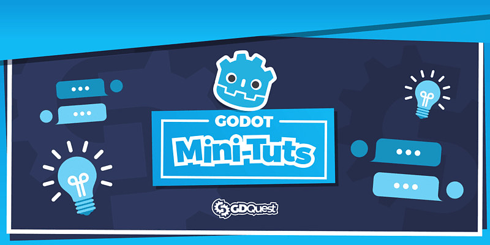

# Godot Mini Tuts Demos

A collection of Free and Open-Source companion demos for our [Godot tutorials](https://www.gdquest.com/tutorial/godot/). Each demo shows how to solve a specific problem.

➡ Follow us on [Twitter](https://twitter.com/NathanGDQuest) and [YouTube](https://www.youtube.com/c/gdquest/) for free game creation tutorials, tips, and news! Get one of our [Godot game creation courses](https://gdquest.mavenseed.com/) to support our work on Free Software.

## Licenses

This project is dual-licensed:

- The source code is available under the MIT license.
- Art assets (images, audio files) are [CC-By 4.0](https://creativecommons.org/licenses/by/4.0/). You can attribute them to `GDQuest and contributors (https://www.gdquest.com/)`.
